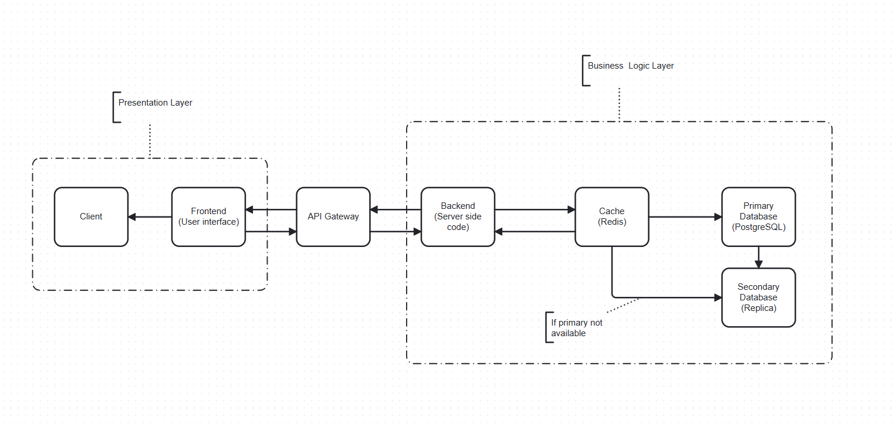

# Corporate Internal Communication Platform (CICP)

An integrated platform designed to streamline, secure, and enhance internal company communication. CICP unifies messaging, notifications, news feeds, and collaborative group spaces into a centralized, user-friendly solution.

---

## Key Features

- **News Feed**: Centralized announcements and updates.
- **Group Spaces**: Collaborative areas for teams and projects.
- **Notifications**: Alerts for important updates and mentions.
- **Role-Based Access Control (RBAC)**: Permission management tailored to user roles.
- **2-Factor Authentication (2FA)**: Secure login with email verification.
- **Admin Panel**: Management of users, posts, and resources.

---

## System Design

## Technologies Used

### Backend
- **Framework**: Django Rest Framework (DRF)
- **Database**: SQLite (development), with planned scalability to PostgreSQL
- **Authentication**: JWT and OPT with email verification

### Frontend
- Planned integration with a modern frontend framework (e.g., React, Vue).

### Deployment 
- Dockerized environment for scalable deployment
- CI/CD pipeline for testing and deployment

---

## Team Members

- **Tuzelbayev Daniyal** - **Project Manager (PM)**, Student ID: 21B030935
- **Zhumabayev Askar** - **Engineer & Analyst**, Student ID: 22B030361

---

## Project Milestones

| Target Date   | Milestone           | Description                                       | Exit Criteria                          |
|---------------|---------------------|---------------------------------------------------|----------------------------------------|
| 2024-12-15    | **Design Ready**    | Finalized platform designs                       | Approved by stakeholders               |
| 2025-01-07    | **Beta**            | Functional platform for 20 test users            | Positive feedback, no critical bugs    |
| 2025-02-01    | **Early Access**    | Scaled release to invite-only groups             | Significant engagement by one team     |
| 2025-03-15    | **Launch**          | Organization-wide deployment                     | 80% adoption, key metrics achieved     |

---

## Resources
- **Designs and Notes**: Available in the [docs/](docs/) folder.
- **Disaster Recovery Plan (DRP)**: [Link](https://docs.google.com/document/d/1fyIfGXy2Jen2wFl4sd7K2Zaij-f93697/edit?usp=sharing)
- **IT Budget**: [Link](https://docs.google.com/spreadsheets/d/1Oh8om0almQqjz-KGN_XuzfxiMNABQO9cUPeg6YlCYmg/edit?usp=sharing)
---
